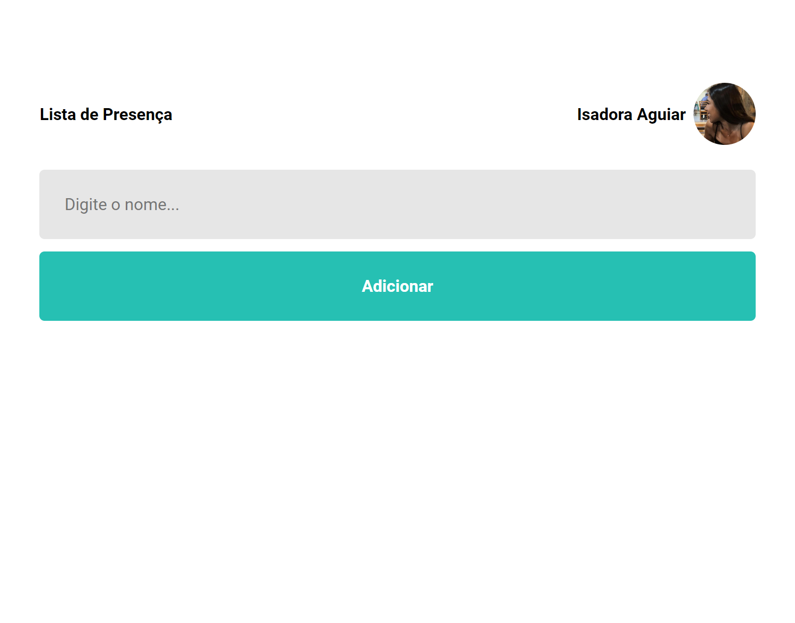

<h1 align="center"> Lista de Presença </h1>

Projeto de uma lista de presença utilizada para aprender Reactjs no Especializar do Discover da Rocketseat.  

  

  

 <h2 align="center"><a href="list-react-five.vercel.app/" target="_blank">Projeto ao vivo</a></h2>

### 🚀 Tecnologias

Esse projeto foi desenvolvido com as seguintes tecnologias:

- HTML e CSS
- React JS
- Vite
- Javascript
- Git e Github

### :memo: Licença

Esse projeto está sob a licença MIT.

---

Feito com ♥ por Isadora Aguiar :wave:
